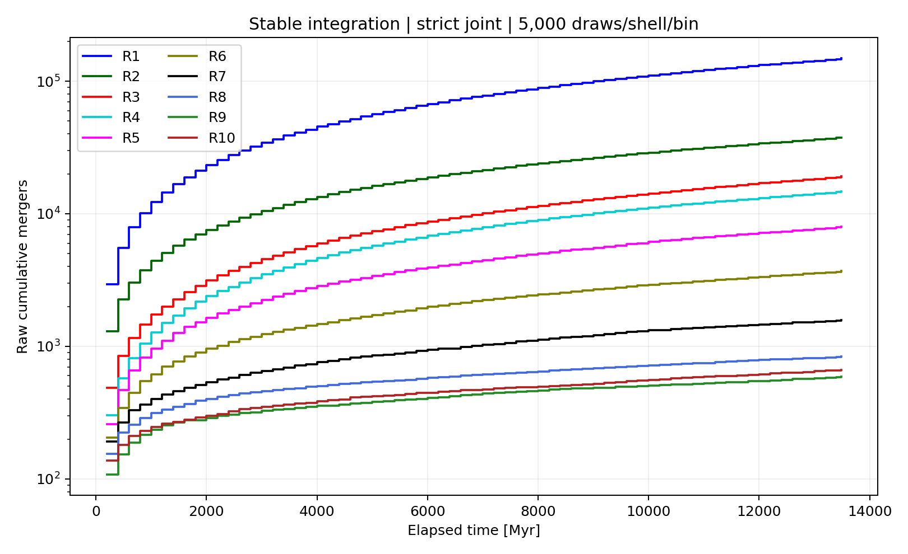
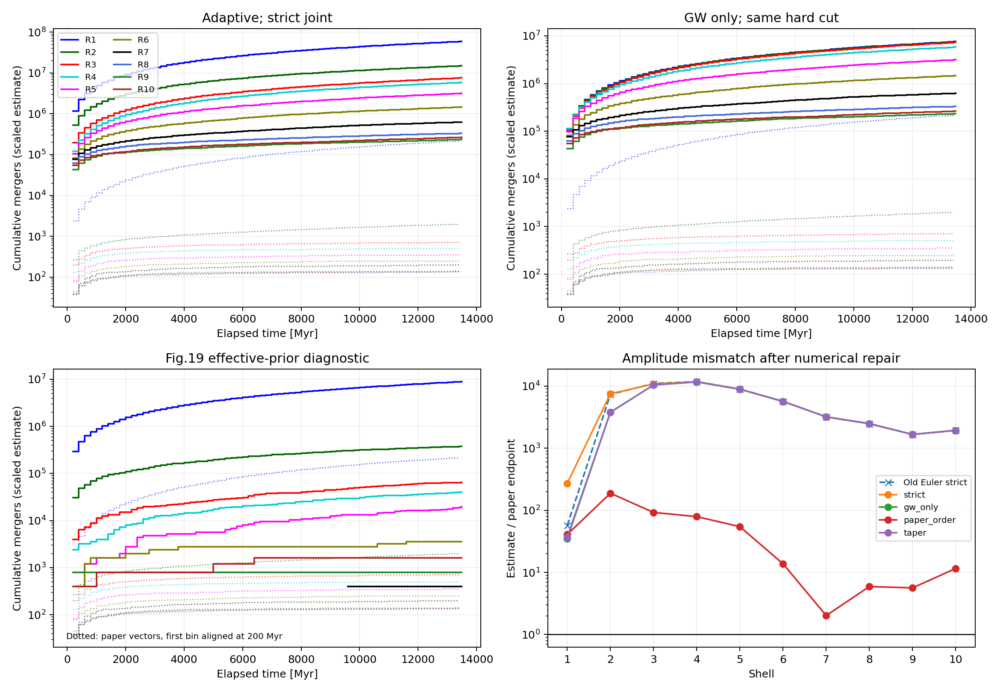

# 各壳层 PBH merger 结果诊断

日期：2026-09-23。问题现场备份：`e0ff270 图12复现问题的出现`。

## 1. 本次解决了什么，什么仍未复现

已修复造成内壳大量轨道失效的积分问题，并得到可重复、经过收敛对照的十壳结果。原来每壳每片 5,000 个样本的运行中，118,810 条硬双星轨道被标为数值失效；相同抽样序列的新运行失效数为 **0**。R1 累计并合由 31,172 增至 **148,409**，R2 为 **37,650**，恢复了内壳 R1 主导的排序。

但是，**原文 Fig.12 的绝对幅度尚未定量复现**。保留用户指定的严格联合分布、Prada12-HMF、默认环境参数、当前 K 高偏心率端点规则和方案 A 后，新结果按论文样本量换算，仍比原图高约 271–11,665 倍。数值修复使此前被丢失的内壳事件得到计算，因此 R1 的幅度差距反而扩大；不能把曲线排序修复称为原图全部复现。

本报告给出了三个彼此不同的结论：

1. Euler 大步长导致的轨道越界已经修复，并有独立积分器、容差、解析 GW 解和终止半径对照。
2. 外壳的高并合计数主要来自严格初态分布中极高偏心率的硬双星，本身的 GW 演化就能产生这些事件；它不是通过微调 halo 浓度能消除的偏差。
3. 内壳的额外并合强烈依赖 K 在 e>0.9 的延拓。原文未公开足以唯一确定其抽样尾部、K 延拓和 Euler 越界处理的实现，因此不能把某个更贴近原图的诊断分支指定为作者算法。



## 2. 固定的模拟口径

| 项目 | 本次主设置 |
|---|---|
| 当前 halo 质量 | M0=1.15×10^12 Msun |
| PBH 双星质量 | m1=m2=30 Msun |
| 浓度及吸积史 | prada12_hmf_sigma |
| 初态 | Appendix D 在 10^-6<a/pc<1、0<j<1 内整体归一化的严格联合分布 |
| 初态 rho_eq | 1614.9730832622506 Msun/pc^3，沿用 p_a_j 的 Planck 参数 |
| halo 环境宇宙学 | Prada12-HMF 的 WMAP5-like 参数 |
| 环境密度 | rho_env=rho_NFW，壳层中点评价 |
| 环境速度 | v=sqrt(0.5 G M(<r)/r)，多壳时在外边界评价 |
| 初始硬双星筛选 | a0<=a_h=G m1/(4v^2) |
| K | Sesana q=1 表 3；对 K 值按当前 e 插值；e>0.9 固定端点 |
| 样本演化口径 | 方案 A，每个时间片、每个壳层独立重抽 |
| 全局环境步 | 200 Myr；末片 84.0362189746 Myr |
| 时间范围 | z=12 到 z=0，共 68 片，13,484.0362189746 Myr |
| 每壳每片样本 | 5,000；10 壳，共 3,400,000 次抽样 |
| 随机数 | seed=20260922，chunk_size=5000 |
| 新积分器 | adaptive_log_a；相对容差 10^-6 |

本次计数没有人口重加权、HMF 积分或 cohort 继承。分母始终是全部抽取的 N_sample，不是通过筛选后的 N_hard。筛掉的软双星不演化，但仍属于抽样分母。

`BinarySingleConfig` 现在默认使用稳定的 `adaptive_log_a`。原始数值分支仍可通过 `integration_method='euler'`、`local_timestep_myr=2.0` 显式调用。自适应分支的精度由容差和 `integration_max_log_a_step` 决定；旧的 `local_timestep_myr` 不控制它。驱动返回的 `local_timestep_per_step_myr` 在自适应分支为 NaN，避免将 2 Myr 错当成实际自适应步长。

## 3. 原图的数字化基准与时间标签

参考源是作者 arXiv v2 源文件中的 `tmp/arxiv_2408.06515v2_source/Merger3body_N1.1_c_v1.pdf`。采用 PyMuPDF 读取矢量线段，用全部 6 个横轴主刻度与 4 个纵轴主刻度分别标定线性时间、log10(N) 坐标；没有按截图像素或 Matplotlib 默认颜色猜测。

读取了 10 条曲线的全部水平线段，并保存源文件 SHA-256 和坐标变换。原图终点读数如下，整数显示为四舍五入结果；原始浮点读数保留在 CSV 中：

| 壳层 | 原图累计终点 |
|---|---:|
| R1 | 219,397 |
| R2 | 2,010 |
| R3 | 711 |
| R4 | 506 |
| R5 | 360 |
| R6 | 262 |
| R7 | 198 |
| R8 | 135 |
| R9 | 142 |
| R10 | 138 |

原图在标为 t=0 的位置已经有第一片事件，例如 R1 为 2,377，R10 为 38。其累计值共有 67 个时间片标签，位于 0、200、…、13,200 Myr；最后水平段延伸到 13,400 Myr。本项目按实际完成时间记录事件，第一片放在 t=200 Myr。叠图将原图的计数标签加 200 Myr 以对齐已完成的时间片，数字化文件同时保留原始标签。

下面直接比较原图起点标记处的十壳计数与主运行第一片的期望值。原图起点的首点是首个累计时间片的结果；对应本运行的 z=12 起步区间，完成时刻为 200 Myr。换算因子为 2,000,000/5,000=400；“±MCSE”是对 5,000 样本二项误差的线性换算标准误差，表示期望估计精度，不是 2,000,000 样本实际运行的误差。

| 壳层 | 原图起点首片 | 本运行首片原始计数 / 5,000 | 论文样本量期望估计 ± MCSE | 估计 / 原图 |
|---|---:|---:|---:|---:|
| R1 | 2,377 | 2,930 | 1,172,000 ± 13,933 | 493.1 |
| R2 | 268 | 1,301 | 520,400 ± 12,411 | 1,941.8 |
| R3 | 199 | 485 | 194,000 ± 8,372 | 974.9 |
| R4 | 132 | 302 | 120,800 ± 6,739 | 915.2 |
| R5 | 85 | 260 | 104,000 ± 6,281 | 1,223.5 |
| R6 | 79 | 205 | 82,000 ± 5,609 | 1,038.0 |
| R7 | 40 | 192 | 76,800 ± 5,436 | 1,920.0 |
| R8 | 38 | 155 | 62,000 ± 4,903 | 1,631.6 |
| R9 | 45 | 108 | 43,200 ± 4,112 | 960.0 |
| R10 | 38 | 138 | 55,200 ± 4,634 | 1,452.6 |

首片对照与终点对照方向一致：在当前严格联合分布与动力学下，每个壳层第一片的样本量期望估计都已高于原图终点，差距约 493–1,942 倍。MCSE 约占估计值 1.2%–9.5%，远小于这些比值；所以首片偏差不能用 5,000 样本的随机涨落解释。

主运行按当前宇宙学到 z=0，多出最后 84.036 Myr 短片。只比较前 67 片时，各壳主结果减少约 0.85%–1.45%，不能解释数量级差距。

论文“丢弃首片、从约 z=10 展示”的陈述对应相邻时间片平均的并合率图。Fig.12 是累计事件数，保留首片。本项目第一片中点约 z=10.13，末边界约 z=8.82。

数据：[原图参考点](pic_and_data/fig12_diagnosis/paper_reference.csv)、[原始水平线段](pic_and_data/fig12_diagnosis/paper_vector_segments.csv)、[标定与源文件指纹](pic_and_data/fig12_diagnosis/paper_reference_metadata.json)。

## 4. Euler 失效的具体原因与修复

### 4.1 失效来自哪里

原内核对当前轨道做一步显式更新：

$$
a_{n+1}=a_n+\Delta t\,\dot a_n,\qquad
e_{n+1}=e_n+\Delta t\,\dot e_n.
$$

当环境项将 e 推近 1 时，GW 项按高次幂迅速增长。2 Myr 步长可能从 GW 尚不强的位置直接跨到 e>=1，跳过 GW 主导的狭窄演化阶段。在先前固定 2,000 初态的 z=12、R1 对照中，1,049 条失效轨道全部是 a 仍正而下一步 e>=1，没有 e<0 或非有限右端。这种失效不能解释为物理上未并合，也不能直接把所有失效重新标成并合。

### 4.2 等价变量变换

Eqs.(19)/(25) 没有改动。由于 rho>=0 且 GW 损失使 a 单调减小，定义

$$
u=\ln(a_0/a),\qquad y=\ln(j^2)=\ln(1-e^2).
$$

以 u 为独立变量、t 和 y 为两个积分状态。令

$$
A=G\rho_{\rm env}/v,\quad
B=\frac{64}{5}\frac{G^3m_1m_2(m_1+m_2)}{c^5},
\quad P(e)=1+\frac{73}{24}e^2+\frac{37}{96}e^4,
$$

$$
s_{\rm env}=AHa,\quad s_{\rm GW}=B a^{-4}j^{-7}P(e),\quad s=s_{\rm env}+s_{\rm GW}.
$$

那么

$$
\frac{dt}{du}=\frac1s,
$$

$$
\frac{dy}{du}
=-\frac{2eK}{j^2}\frac{s_{\rm env}}s
+\frac{19}{6}\frac{e^2(1+121e^2/304)}{P(e)}\frac{s_{\rm GW}}s.
$$

实际代码使用 pc、Myr 的换算后系数，并在对数域合成两个速率，避免先计算极大的 j^-7。GW 主导末期 dt/du 趋于零，dy/du 保持有限，因此不需要用固定时间步硬跨 a=0。保存 y 也避免了反复计算 1-e^2 的精度损失。

实现使用 SciPy RK45 的 Dormand–Prince 5(4) 系数和四次稠密输出，每条轨道独立调节 u 步长。超出物理域的试探步被拒绝、缩小后重算；不裁剪已接受的 e 来增加事件。遇到时间边界，用稠密输出定位 t=Delta t；遇到并合终点，记录事件时间。

终点明确设置为 a_stop=6G(m1+m2)/c^2。这是本项目的数值终止约定，不能称为文章明确指定的阈值。结果对象中 a=0 是已终止的标记，不表示积分器真的在奇点求值。

### 4.3 同一批初态的收敛记录

固定 seed=12、500 初态，z=12 的 R1，其中硬双星 355 条：

| 方法 | 步长或相对容差 | 并合 | 失效 |
|---|---:|---:|---:|
| Euler | 2 Myr | 36 | 239 |
| Euler | 0.2 Myr | 72 | 203 |
| Euler | 0.02 Myr | 134 | 141 |
| 自适应 | 10^-4 | 275 | 0 |
| 自适应 | 10^-6 | 275 | 0 |
| 自适应 | 10^-8 | 275 | 0 |
| 更紧参考解 | 10^-10，且收紧绝对容差 | 275 | 0 |

这里 239 条旧 Euler 失效恰好对应分类差异 239；判断来自重新积分，而非将失效标签批量转换。

其他实际核验：

- 变量变换的右端与原 SI 单位 Eq.(19)/(25) 经链式法则计算的结果最大相对差约 8.95×10^-11。
- 71 条硬双星用独立 SciPy DOP853、rtol=10^-10 对照：全部求解成功，事件分类差异 0，最大并合时间差 0.002572 Myr；幸存轨道 a 的最大相对差约 1.72×10^-8。DOP853 共用变换后的物理右端，这一项验证积分实现；上一项单独验证变量变换。
- 圆轨道、rho=0 的解析 GW 例子，理论并合时刻 100 Myr，数值为 100.00002129 Myr；另一条幸存轨道的 a 相对误差约 8.58×10^-10。
- a_stop 在 3、6、60 GM/c^2 之间变化，500 初态的并合数均为 275，失效均为 0，最大事件时间变化约 9.52×10^-12 Myr。
- 完整 340 万初态再以 rtol=10^-8、时间绝对容差 10^-10 Myr、log(j²) 绝对容差 10^-11 重算，680 个壳层-时间片组合只有 **1 个组合相差 1 个事件**：第 7 片 R2（片首 z=4.03168），643 对 642。总计数差约 4.25×10^-6，相比 Monte Carlo 误差可忽略，但并非宣称逐事件在有限容差下绝对无误。

数据：[收敛表](pic_and_data/fig12_diagnosis/integration_convergence.csv)、[DOP853 逐轨道对照](pic_and_data/fig12_diagnosis/dop853_comparison.csv)、[终止半径对照](pic_and_data/fig12_diagnosis/termination_radius.csv)、[完整运行收敛](pic_and_data/fig12_diagnosis/full_history_convergence.json)。

## 5. 十个壳层的修复结果

以下全部“原始计数”均对应每壳每片 5,000 个样本，不能直接与原图每壳每片 2,000,000 样本的计数相减。

| 壳层 | 旧 Euler 并合 | 旧失效 | 稳定积分并合 | 稳定 GW-only | K 衰减诊断 |
|---|---:|---:|---:|---:|---:|
| R1 | 31,172 | 117,232 | 148,409 | 19,175 | 20,223 |
| R2 | 36,700 | 1,578 | 37,650 | 18,974 | 19,020 |
| R3 | 19,516 | 0 | 19,140 | 18,434 | 18,441 |
| R4 | 14,889 | 0 | 14,756 | 14,729 | 14,729 |
| R5 | 8,011 | 0 | 7,988 | 7,986 | 7,986 |
| R6 | 3,704 | 0 | 3,698 | 3,698 | 3,698 |
| R7 | 1,577 | 0 | 1,575 | 1,575 | 1,575 |
| R8 | 836 | 0 | 836 | 836 | 836 |
| R9 | 590 | 0 | 589 | 589 | 589 |
| R10 | 667 | 0 | 666 | 666 | 666 |

稳定主运行共 415,033 个硬双星，235,307 个并合，179,726 个硬双星在片末仍存活，2,984,967 个软双星未演化，失效为 0。每条原始样本只进入一个结果类别。表中的旧失效是旧方法的数值失败数，不是额外的物理并合人口。

乘以 2,000,000/5,000=400 后，主运行与原图对照为：

| 壳层 | 主运行的论文样本量期望估计 | 原图终点 | 比值 | 主运行 MC 相对标准误差 |
|---|---:|---:|---:|---:|
| R1 | 59,363,600 | 219,397 | 270.6 | 0.195% |
| R2 | 15,060,000 | 2,010 | 7,492.5 | 0.485% |
| R3 | 7,656,000 | 711 | 10,767.9 | 0.702% |
| R4 | 5,902,400 | 506 | 11,664.8 | 0.805% |
| R5 | 3,195,200 | 360 | 8,875.6 | 1.105% |
| R6 | 1,479,200 | 262 | 5,645.8 | 1.634% |
| R7 | 630,000 | 198 | 3,181.8 | 2.508% |
| R8 | 334,400 | 135 | 2,477.0 | 3.444% |
| R9 | 235,600 | 142 | 1,659.2 | 4.108% |
| R10 | 266,400 | 138 | 1,930.4 | 3.860% |

标准误差由各片独立 Bernoulli 抽样计数估计，再乘以 400；这个换算不会把 5,000 样本变成真正的 2,000,000 样本运行。主运行的统计误差远小于与原图的偏差。因而先提高到论文生产样本量不会解决当前幅度问题。

数据：[逐壳汇总](pic_and_data/fig12_diagnosis/shell_summary.csv)、[主运行逐片结果](pic_and_data/fig12_diagnosis/strict_counts.csv)、[主运行累计曲线](pic_and_data/fig12_diagnosis/strict_cumulative.csv)。

## 6. 为什么外壳会出现几乎“硬双星全并合”

GW-only 对照保持完全相同的初始硬双星阈值、抽样序列和时间网格，仅把环境密度设为零。在主运行中，R6–R10 的累计计数与 GW-only 相同。R3 的净增加只有 706，R4 为 27，R5 为 2；R1 和 R2 的净增加分别为 129,234、18,676。

累计数相同本身不证明所有事件身份相同，因此另做了逐轨道配对：在 z=12、3、0，各自固定同一批 5,000 初态，比较完整模型与 GW-only。三个红移的 R5–R10 中，事件掩码均相同。例如 z=12 的 R10 有 138 个硬双星，完整模型和 GW-only 都有同样的 126 个并合；z=0 时 R10 的 5 个硬双星在两种模型中都并合。

逻辑链是：外壳速度较高，a_h 很小；严格联合分布在筛出小 a 的同时，又筛出了非常小的 j，即极高 e。Peters 并合时间在高偏心率极限强烈依赖 a^4 j^7。这样得到的硬双星即使没有三体环境也能在 200 Myr 内并合。

因此“外壳密度低”并不保证这里的总 N_merger 很低；当前记录的事件包含 GW 自发并合背景。完整模型减 GW-only 是同一抽样集合的净变化诊断，不能在未定义人口与通道重叠时直接作为一个独立可相加的物理并合率。

主历史的 R10 仅首个时间片就有 138 个事件，GW-only 也是 138 个；换算到论文样本量已经是 55,200，而原图 R10 **整个历史**约为 138。这个具体对照说明，即使暂不考虑之后所有时间片，也无法靠修复内壳 Euler 或轻微调整 K 消除外壳偏差。

方案 A 每片从同一原初分布重新抽样，也会在每一片重新引入短 GW 寿命的双星。这是本次指定的模拟语义。改变全局时间片长度会同时改变重抽次数和每片允许的并合时长，不能简单当作只影响数值积分精度的参数。方案 B 或先演化 halo 外的分布会改变人口模型，本次未引入。

数据：[同初态事件交集与差集](pic_and_data/fig12_diagnosis/paired_event_outcomes.csv)。

## 7. 严格初态与 Fig.19 有效先验的差异

各取 1,000,000 个样本，seed=22：

| 统计量 | 严格联合分布 | Fig.19 顺序的有效先验诊断 |
|---|---:|---:|
| 平均 a，pc | 0.0104462 | 0.0353254 |
| a 中位数，pc | 0.0053741 | 0.0236146 |
| 平均 e | 0.884199 | 0.725575 |
| e 中位数 | 0.963957 | 0.782911 |
| e>0.9 比例 | 67.661% | 27.235% |
| a<=1.07×10^-2 pc 的比例 | 68.9704% | 24.7966% |
| a<=1.79×10^-5 pc 的比例 | 0.8504% | 0.0056% |
| a<=3.17×10^-6 pc 的比例 | 0.1520% | 0.0004% |

最后一个阈值处，严格分布筛出的硬双星 e 中位数约 0.999999465，而有效先验诊断约为 0.993686。后者只有 4 个尾部样本，精度有限；它已经足以说明只比较平均 a 会遗漏影响并合最强的联合尾部。

有效先验诊断调用已有 `sample_figure19_orbital_parameters`：先采 j，再采 a|j。其 j_scale=1.088798521872047、a_scale=0.034694 pc 来自既有 Fig.19 反推，不能称为 D1–D5 和宇宙学唯一给出的结果，也没有在本次重新调参贴合 Fig.12。

只替换这个先验，保持稳定积分和其他物理设置不变，十壳原始终点为：

`[22350, 944, 164, 100, 49, 9, 1, 2, 2, 4]`。

它显著降低外壳计数，但 R1、R2 换算后仍分别高出原图约 40.7、187.9 倍；R7–R10 只有 1–4 个事件，不能据此声称精准复现这些壳层。反推先验匹配 Fig.19 的均值，也不等于匹配其稀有尾部或 Fig.12。

原文 Table II 的 a_h 列标题写 au，但 10^12 Msun、R1 行给 1.07×10^-2，且 N_hard=26.523%。若真把该数解释为 au，它小于 Appendix D 的最小半长轴 10^-6 pc，硬双星比例应为零。这是源文档内的单位不一致；上述阈值对照显式采用 pc，不在程序里偷偷改单位。

数据：[初态总体统计](pic_and_data/fig12_diagnosis/prior_summary.json)、[硬双星尾部统计](pic_and_data/fig12_diagnosis/prior_hard_tail.csv)、[有效先验整条历史](pic_and_data/fig12_diagnosis/paper_order_counts.csv)。

## 8. K 的原始拟合没有抄错，但延拓支配内壳

重新对照 [Sesana, Haardt & Madau (2006), Eq.(18) 和 Table 3](https://arxiv.org/pdf/astro-ph/0604299)：现有 q=1 的 A、a0/a_h、gamma、B 六组参数与表中一致。原拟合背景为轻得多的入射场星和大质量黑洞双星，e 表列范围是 0.15–0.9。将它应用于同质量第三体 PBH、按当前 e 插值、再在 e>0.9 固定端点，包含不同层次的模型外推。

主运行有 373,997/415,033，约 90.1% 的硬双星曾超出 e=0.9。为了量化延拓影响，新增显式诊断选项：

$$
K_{\rm taper}=K_{\rm endpoint}\min\!\left[1,\frac{1-e^2}{1-0.9^2}\right].
$$

该式让 e 接近 1 时 K 衰减，是敏感性函数，不是新增的 Sesana 原始拟合。还提供 K=0 对照，它保留环境对 a 的硬化，只关闭环境对 e 的激发。

z=12、R1 固定 5,000 初态：端点 K 得到 2,930 个并合，K 衰减为 336，K=0 为 294；相同 GW-only 为 260。完整历史中，端点 K 的 R1 为 148,409，衰减诊断为 20,223，相差约 7.34 倍。R6–R10 对这个改动没有计数响应。

这说明稳定求解后的内壳结果仍有很大的模型不确定性。不能因为某个 K 延拓更接近原图就将它升为默认物理修正。本次主设置仍为用户指定的端点 K；新默认的改变仅是积分方法。

## 9. halo 设置能解释多少差距

在每个红移都固定同一批严格初态，每次只改变一个设置，R1 的并合数如下：

| 设置 | z=12 | z=3 | z=0 |
|---|---:|---:|---:|
| 主设置 | 2,930 | 2,143 | 2,101 |
| 速度改在壳中点评价 | 3,681 | 2,929 | 2,797 |
| mu 从 0.5 改为原文印刷式的 2 | 1,454 | 936 | 912 |
| 浓度/吸积史切为项目 Ludlow16 | 3,143 | 2,111 | 2,062 |
| 初态 rho_eq 换成 Prada 宇宙学换算 | 2,921 | 2,128 | 2,092 |

全部诊断失效数为零。这里的 Ludlow16 是项目已有实现，不能用单条 halo 的结果推翻此前发现的跨质量映射问题，也不用于新的 HMF 积分。

在 z=12 的 R10 中，主设置有 126 次并合，Ludlow16 为 118，mu=2 为 49。即使是这些有实际影响的改动，也远小于主结果与原图的差距。内壳应优先处理 K 的物理标定问题，外壳应优先追查联合分布的尾部与重抽/事件统计定义。

数据：[逐项环境与 K 敏感性](pic_and_data/fig12_diagnosis/frozen_sensitivity.csv)。



## 10. 误差账本与可验收范围

| 类别 | 当前证据 | 处理结果 |
|---|---|---|
| Euler 越界丢失内壳事件 | 旧运行 118,810 失效，步长强敏感 | 稳定积分修复；新运行 0 失效 |
| 积分容差 | 340 万初态收紧容差只差 1 事件 | 有限数值误差已量化 |
| a_stop | 3–60 GM/c^2 不改变分类 | 不是目前幅度主因 |
| 原图读取 | PDF 矢量路径与全部主刻度 | 已保存参考点和标定元数据 |
| 首片标签/末片长度 | 原图 t=0 已有首片；主运行有短末片 | 显式对齐；影响约百分之一 |
| Monte Carlo 噪声 | 主运行相对标准误差 0.2%–4.1% | 无法解释数量级偏差 |
| 初态联合尾部 | 硬双星比例及条件 e 差异显著 | 已定位，主严格分布不调参 |
| e>0.9 的 K | 内壳计数可变化约 7 倍以上 | 保留为主要模型不确定性 |
| halo 参数 | 单变量对照约百分之几至倍数变化 | 已量化，非外壳巨大差距主因 |
| 方案 A 重抽语义 | 每片重新引入短寿命原初双星 | 按本次要求保留；不能视为人口继承 |

可验收的是：当前指定物理设置与方案 A 的积分、事件接口、逐片累计和参数记录已经能稳定工作。不可验收的是：将这套设置的曲线称为与原文 Fig.12 数量上吻合。文章本来采用 Ludlow16，而当前请求采用 Prada12-HMF；严格联合抽样也与作者文字顺序和图示有效先验不同。强行让它们在所有壳层给出同一组数字没有充分依据。

若要进一步确定“作者 Fig.12 到底怎样生成”，需要补齐的具体信息为：

1. Appendix D 先采 j 时 x/x_bar 的固定或边缘化规则，以及 a|j 的实际归一化、截断和逆 CDF。
2. K 在 e>0.9 时的实现，以及是随当前 e 更新还是使用初始 e。
3. Euler 下 e 越界、a 接近零的阈值，以及是否提前用 GW 时标处理末期。
4. Fig.12 是否包含未经三体增强就能并合的初态，N_sample 是否每片重新抽取全部分布，以及时间标签的具体定义。

本次检查了目标文章页面及现有源文件，并做了公开代码检索，没有取得该图的作者生成代码。这不等于证明作者未公开任何代码；这里只报告本次没有获得可验证的实现。未替用户联系作者。

## 11. 修改文件、数据和复现方法

- [binary_single.py](binary_single.py)：稳定积分器、明确终止半径、可替换精度；保留 Euler 和端点 K；增加标明用途的 K 敏感性开关。
- [binary_single_montecarlo.py](binary_single_montecarlo.py)：接入所选积分器、每片进度回调，以及自适应分支的时间步元数据。
- [fig12_diagnostics.py](fig12_diagnostics.py)：原图矢量提取、积分对照、全历史对照、初态与配对事件、敏感性和绘图入口。
- [notebooks/fig_12.ipynb](notebooks/fig_12.ipynb)：已执行，展示原图、稳定主运行、逐壳比值和诊断图。默认加载已保存结果并校对参数；设 RUN_MONTE_CARLO=True 可调用主驱动重算。
- [pic_and_data/fig12_diagnosis](pic_and_data/fig12_diagnosis/)：CSV、NPZ、JSON 和 PNG。旧 pilot 文件保留原名，便于与问题现场比较。

在项目根目录运行：

```powershell
python fig12_diagnostics.py --task integration
python fig12_diagnostics.py --task runs --variants strict,strict_tight,gw_only,paper_order,taper
python fig12_diagnostics.py --task sensitivity
python fig12_diagnostics.py --task prior
python fig12_diagnostics.py --task plot
```

默认样本为每壳每片 5,000，可用 `--samples` 替换；完整历史的 seed 默认为 20260922。`integration` 的局部诊断固定使用 seed=12；百万初态尾部诊断固定 seed=22。对照分支应使用同样的样本量、种子和分块。改变 chunk_size 会改变生成器的消费顺序，因此也属于可重复性参数。

本次环境：Python 3.13.12、NumPy 2.4.2、SciPy 1.17.1。已实际完成五种完整历史、独立积分对照、原图提取和 notebook 执行。没有新增人口权重、HMF 或继承模块。

参考：[目标文章 v2](https://arxiv.org/html/2408.06515v2)、[Sesana 原拟合](https://arxiv.org/pdf/astro-ph/0604299)。文章设置和 Table II 的核对亦使用项目内的 `paper.tex` 原始源文件。
