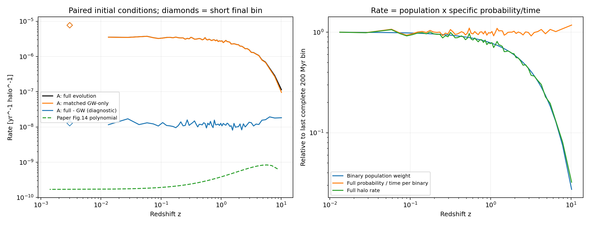
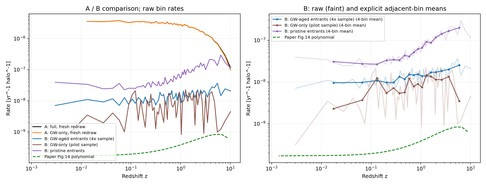
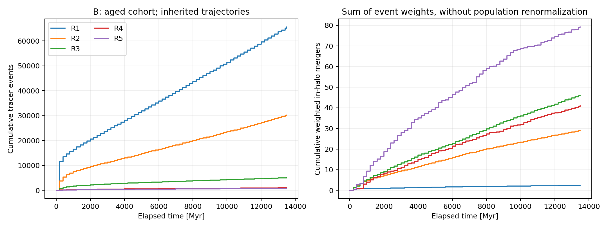

# 单 halo 并合率演化诊断报告

日期：2026-09-23。对象：`notebooks/R_bs_perhalo.ipynb`，今天的 halo 质量 $M_0=1.5\times10^6M_\odot$。本次保留方案 A，新增方案 B；不做人口跨质量重加权或 HMF 积分。

## 1. 结论与完成边界

目前的主要问题不是红移轴倒置或 Myr/yr 换算，而是**将每片独立抽取的、未经年龄演化的原初双星分布，反复赋予整个当前 halo 的双星人口权重**。这种方案 A 可以定义为一个独立窗口实验，但不能直接解释为同一个 halo 的守恒人口历史。

每片都会重新出现短 GW 寿命尾部；随着 halo 吸积、人口权重变大，其贡献在低红移被不断放大。匹配初态的 GW-only 对照解释了低红移总率的超过 99%。因此，“含第三体项的全部并合”不等于“第三体额外造成的并合”。

根据本次授权，主干程序新增 cohort 方案 B：存活者继承轨道，已并合者永久退出，只有新增质量带来的新人口获得新权重；默认新入晕轨道先做与宇宙年龄一致的晕外 GW 演化。具体运行和图像放在原来的 notebook 中，A 的缓存与对照保留。

实际结果：A 全史加权并合期望为 **35,679.77**；B 四倍样本运行的晕内并合期望为 **197.46**，人口账本闭合误差不超过 **$3.64\times10^{-12}$**。原来随时间强烈增大的趋势已不再出现；B 的区间平均率总体表现为高红移较大。

**尚未完成论文定量复现。** B 的幅度仍明显高于原图，高红移时间片存在抽样敏感性；本次修正人口解释与实现，不通过改符号、强行平滑、拟合幅度或挑选参数制造目标曲线。

## 2. 比较对象和共同设置

论文：[Simulating Binary Primordial Black Hole Mergers in Dark Matter Halos](https://arxiv.org/html/2408.06515)，第 IV 节、式 (19)–(26)、式 (32)、Fig. 14。

本地原图：`tmp/arxiv_2408.06515v2_source/plot_1526417.97_X.pdf`。文件名对应质量 1,526,417.97，图注近似写 $1.5\times10^6M_\odot$，相差约 1.76%，不能用来解释数量级差异。数字化直接读取 PDF 矢量路径和坐标刻度，不从截图估计曲线。

本次共同设置：

| 项目 | 设置 |
|---|---|
| halo | $M_0=1.5\times10^6M_\odot$，5 壳层 |
| 浓度/吸积史 | 用户指定的 `prada12_hmf_sigma`；原文此组模拟使用 Ludlow16，二者不可混称 |
| 初态 | `p_a_j.AppendixDOrbitalDistribution` 严格联合分布，$10^{-6}\leq a/\mathrm{pc}\leq1$ |
| PBH | $m_1=m_2=30M_\odot$，$f_{\rm PBH}=1$，初始双星质量份额 0.5 |
| 环境 | 原有默认密度，`velocity_mu=0.5`，`ksi=1` |
| 偏心率系数 | 既有 `sesana_endpoint` 设置，没有为改善曲线而修改 |
| 积分 | `adaptive_log_a`，rtol $10^{-6}$，最大 $\Delta\log a=0.25$ |
| 时间 | 从 $z=12$ 开始，环境步 200 Myr，最后一片 84.03621897 Myr |
| A 规模 | 每壳每片 5,000 个，总计 1,700,000 个样本 |
| B 初跑 | 每壳初始 5,000 个，之后每个有质量供给的边界每壳 256 个 |
| B 四倍运行 | 每壳初始 20,000 个，后续每壳每边界 1,024 个 |
| 随机数 | seed 20260923；改变样本数会改变后续随机数分配，不是严格嵌套样本 |

`local_timestep_myr=2` 仍保留为 Euler 配置，但本次 Adaptive 运行不使用固定 2 Myr 作为实际积分步。全局环境步与局部误差控制参数仍分别可替换。新增 cohort 入口目前明确要求 Adaptive，不默默切换到 Euler。

原文的邻片平均规定与原始事件统计分开处理：原始数据保留第一片，其时间中点约 $z=10.13$；展示的 B 平均曲线剔除第一片，再对相邻片合并计数除以总时长。这里只采用显式四片分组，不声称重建作者未公开的多项式平均方法。不能把“第一片中点约为 10”直接等同于“已经丢弃第一片”。

## 3. 式 (32)：累计数怎样转为随红移的率

在方案 A，对第 $k$ 个时间片单独计算

$$
R_{A,k}=\frac{1}{\Delta t_k}\sum_i
\frac{N_{{\rm bin},i,k}}{n_{i,k}}\,n_{{\rm merger},i,k},\qquad
N_{{\rm bin},i,k}=\frac{f_{\rm PBH}f_{\rm binary}M_{i,k}}{m_1+m_2}.
$$

若从累计样本数开始，必须先取相邻累计数之差得到该片事件数，不能将累计数直接除以当前片长。单位为每年每 halo。式 (32) 原文写有时间求和，但绘制 $R(z_k)$ 时必须保留时间索引；把所有时间片的率直接相加并不能得到某一红移的瞬时率。

本次没有发现上述差分或单位错误。真正影响趋势的是输入到该式的统计人口。写成 $R_A=N_{\rm bin}\gamma$ 后，A 中每系统的窗口并合率 $\gamma$ 几乎保持不变，而 $N_{\rm bin}$ 随吸积大幅增长。

## 4. 同初态 full / GW-only 配对诊断

完整回放 A 的全部 340 个壳层—时间片单元。两组使用同一初态、同一硬双星筛选、相同观察窗口；仅关闭环境作用得到 GW-only。完整方程回放与原缓存的事件数逐项一致，失效轨道为 0。

| 时间片 | 中点红移 | 片长 Myr | full 率 | GW-only 率 | GW/full | full−GW |
|---|---:|---:|---:|---:|---:|---:|
| 第一片 | 10.1334 | 200 | $1.14034\times10^{-7}$ | $9.57098\times10^{-8}$ | 83.931% | $1.83241\times10^{-8}$ |
| 最后完整片 | 0.0132984 | 200 | $3.54006\times10^{-6}$ | $3.52844\times10^{-6}$ | 99.672% | $1.16201\times10^{-8}$ |
| 最后短片 | 0.00301444 | 84.0362 | $7.80528\times10^{-6}$ | $7.79227\times10^{-6}$ | 99.833% | $1.30050\times10^{-8}$ |

所有率单位均为 $\mathrm{yr}^{-1}\,\mathrm{halo}^{-1}$。数据：[paired_rates.csv](../pic_and_data/rate_evolution_diagnosis/paired_rates.csv)。

第一片到最后完整片，halo 双星权重从 340.59 增至 12,447.01，约 36.5 倍；质量加权并合概率仅从 0.06696 变为 0.05688。于是原始 full 率增长约 31 倍，主要是重复出现的短寿命人口乘以增长的权重，并不是低红移环境硬化突然强了数十倍。

全史 A 的 full/GW-only 加权累计值分别为 35,679.77 / 35,514.77。若只用今天总质量对应的原初双星系统预算，$0.5M_0/(60M_\odot)=12,500$；在不允许再形成或后代再并合的同一人口解释下，A 累计超过这一预算。这不是说独立窗口概率实验本身算术错误，而是它不能被当成唯一人口的一次完整历史。

差值 $\Delta R=R_{\rm full}-R_{\rm GW}$ 必须保留符号；环境会改变事件发生时间，所以其他窗口可能有负差值。它是配对观察窗口的净效应，不是可无条件作为新物理通道相加的“纯 binary-single 率”。本次不以减去 GW 背景代替人口修正。



## 5. 为什么最后短片出现突起

冻结 $z=0$、R5 环境并使用完全相同的 20,000 个初态，仅改变观察时长：

| 片长 Myr | full 并合数 | GW-only 并合数 |
|---:|---:|---:|
| 84.0362 | 1,060 | 1,060 |
| 100 | 1,066 | 1,066 |
| 200 | 1,134 | 1,134 |
| 400 | 1,198 | 1,198 |

短寿命尾部大多在 84 Myr 内就已并合；200 Myr 延长到更多时间并不会成比例增加事件。因此 fresh-redraw 的率是 $N F(\Delta t)/\Delta t$，84 Myr 对比 200 Myr 得到约 2.22 倍的率。程序已经用了真实片长；简单把最后一片的分母强改为 200 Myr 会掩盖人口时间窗问题，并造成新的单位解释错误。

原始短片保留在缓存，A 单独率图以空心点标识，不与等长片混为一谈。数据：[duration_controls.csv](../pic_and_data/rate_evolution_diagnosis/duration_controls.csv)。

## 6. 其他控制与积分检查

仅改变一个设置的 A 全史控制：

| A 分支 | 第一片率 | 最后完整片率 | 结论 |
|---|---:|---:|---|
| Strict + Prada，主基线 | $1.1403\times10^{-7}$ | $3.5401\times10^{-6}$ | 低红移抬升 |
| Fig.19 有效先验 + Prada | $4.4531\times10^{-9}$ | $3.3705\times10^{-8}$ | 幅度下降，但趋势问题仍在 |
| Strict + Ludlow16 | $7.4000\times10^{-8}$ | $3.5389\times10^{-6}$ | 不消除重复补入问题 |

这不是三个模型的最终精确比较，而是排除“只换浓度模型或采样顺序即可修复人口历史”的控制。严格联合采样与 Fig.19 有效先验仍保持分开；主设置没有替换。

数值核查结果：

- 77 条代表性轨道与独立 DOP853 积分算法比较，事件分类差异 0，最大并合时刻差 $1.5336\times10^{-4}$ Myr；两者使用同一变换后的物理 RHS，因此不是对物理方程的独立验证。
- 从 $z=12$ 到今天，数值积分 $|dt/dz|$ 与当前宇宙学的解析年龄差同为 13,484.03621897 Myr，显示精度内一致。
- 目标壳层质量求和与 halo 质量的相对偏差约 $8.88\times10^{-16}$。
- GW-only cohort 的全部 112,040 个输入样本，直接从形成时刻连续演化到今天，与“晕外先老化、晕内逐片继承”的总死亡权重逐壳一致，最大差 $1.14\times10^{-13}$，失效轨道 0。

这些检查支持当前时间转换、积分和继承接口实现；不替代环境冻结步长、人口模型、Sesana 拟合适用性以及抽样尾部的收敛研究。

## 7. 新增方案 B：接口、算法和明确假设

### 7.1 主干接口

在 [binary_single.py](../binary_single.py) 新增 `evolve_binary_population_batch`。硬双星用既有完整方程；软双星不丢弃，继续纯 GW 演化。本次未加入离解或反冲。事件对象的 `hard_mask` 表示片首硬双星身份，`merged_mask` 可以包含软双星的 GW 事件。

在 [binary_single_montecarlo.py](../binary_single_montecarlo.py) 新增：

- `CohortPopulationConfig`：初始/吸积样本量、入晕老化模型、形成宇宙年龄。
- `CohortOrbitalPopulation`：当前 $(a,e)$、不可重复赋予的权重、入晕边界身份。
- `CohortShellMergerHistory`：每片事件、累计数、供给/晕外死亡/存活账本和最终轨道。
- `run_cohort_shell_monte_carlo`：B 驱动入口；旧 A 入口和原始结果保留。

### 7.2 从输入到输出

1. 沿同一个固定 $M_0$ 的吸积史构造各时间边界和壳质量。继续沿用小 halo 至少约 30 个 PBH 的起始条件。
2. 初始质量及后续各壳新增质量对应的系统供给为
   $$\Delta N_{i,k}=\frac{f_{\rm PBH}f_{\rm binary}\Delta M_{i,k}}{m_1+m_2}.$$
   新抽 $n_{i,k}$ 条严格联合初态，每条代表 $w=\Delta N_{i,k}/n_{i,k}$ 个系统。
3. 默认 `gw_aged`：从形成宇宙年龄推进到入晕宇宙年龄。晕外已经并合的权重记账后退出；未并合者带演化后的 $(a,e)$ 入晕。`pristine` 则保留未老化入口，作为同一 cohort 框架内的控制。
4. 新入晕存活者加入旧存活者。冻结片首环境，推进实际片长；硬/软轨道分别使用完整/GW 演化。
5. 并合者仅记一次事件并永久移除；未并合者把最终轨道与原有权重交给下一片。绝不将这批幸存者重新乘回整个壳层双星人口。
6. 最后 $z=0$ 边界登记最后一段新增质量及其入晕前老化，但不增加虚构的晕内演化时间。
7. 输出加权累计数 $C_k$，逐片率为
   $$R_{B,k}=\frac{C_{k+1}-C_k}{\Delta t_k}=\frac{\sum_{\ell\in\text{该片并合}}w_\ell}{\Delta t_k}.$$
   不再额外乘一次式 (32) 的完整人口因子，否则重复归一化。

逐边界保持

$$N_{\rm supplied}=N_{\rm merged,outside}+N_{\rm merged,inside}+N_{\rm alive}.$$

这是原初双星系统数的账本，不是忽略 GW 辐射损失后的精确物质质量守恒声明。

### 7.3 不是原文唯一确定的算法

当前 B 采用显式闭合假设：所有原初双星在早期共同形成；默认 `formation_age_myr=0` 是极早时刻近似。个体保持壳编号，每壳正质量增量作为新供给，在时间边界注入。不含壳间输运、离解、反冲、再形成、后代再入或并合遗迹质量谱。

每壳质量必须单调增长；出现显著负增量直接报错，不排序、不取绝对值隐藏。该近似不能自动代表任意吸积史上的真实拉格朗日壳运动。

0.5 在 B 中解释为初始/新增物质的原初双星质量份额，不强制每一时刻都把存活双星补回 50%。halo 结构与单 PBH 背景仍使用原有简化模型，不自洽更新遗迹分布。这些都是影响定量答案的限制。

因此 B 是用户授权的人口模型扩展，不应标为“已确认就是作者算法”。

## 8. B 的真实运行结果与采样敏感性

### 8.1 人口账本

| 分支 | 总抽样轨道 | 原初系统供给 | 晕外并合 | 晕内并合 | 今天存活 |
|---|---:|---:|---:|---:|---:|
| B：老化入口，初跑 | 112,040 | 12,500 | 849.7275 | 195.6283 | 11,454.6442 |
| B：老化入口，GW-only 配对 | 112,040 | 12,500 | 849.7275 | 116.7720 | 11,533.5005 |
| B：不老化入口，对照 | 112,040 | 12,500 | 0 | 1,014.3650 | 11,485.6350 |
| B：老化入口，四倍样本 | 448,160 | 12,500 | 861.5214 | 197.4640 | 11,441.0146 |

数量均为加权系统数期望，不是必须为整数的实际 halo 事件。初跑 full/GW-only 使用相同供给初态，可作配对；四倍 full 与初跑 GW-only 不能当作逐轨道配对相减。图中已标明 GW-only 为初跑样本。

### 8.2 区间平均率

以下用时间片中点选入区间，再将事件权重之和除以所选片的总时长；不是均匀红移平均，不是论文多项式拟合。

| 分支 | $z<0.5$ | $1\le z<5$ | $5\le z<10.2$ |
|---|---:|---:|---:|
| B 老化，初跑 | $1.0695\times10^{-8}$ | $1.8602\times10^{-8}$ | $1.4680\times10^{-8}$ |
| B 老化，四倍样本 | $1.0874\times10^{-8}$ | $1.7227\times10^{-8}$ | $2.3991\times10^{-8}$ |
| B 未老化入口 | $3.2313\times10^{-8}$ | $1.1774\times10^{-7}$ | $1.7812\times10^{-7}$ |

四倍运行总晕内并合数只增加约 0.94%，低红移区间均率变化约 1.7%，但高红移区间变化约 63%。**总累计数较稳定不能证明每个红移区间已收敛。** 目前不对细小峰谷作物理解读，也不把四片分组显示当成消除统计误差。

### 8.3 各壳层加权并合期望

| 壳 | B 初跑 | B 四倍样本 | 四倍运行的原始并合轨道数 |
|---|---:|---:|---:|
| R1 | 2.3789 | 2.3793 | 65,556 |
| R2 | 28.8842 | 29.0688 | 30,209 |
| R3 | 44.1491 | 45.9600 | 5,043 |
| R4 | 42.8321 | 40.9198 | 1,005 |
| R5 | 77.3840 | 79.1362 | 775 |

内壳原始事件很多但权重小；不能拿原始计数排名直接解释全 halo 的率。外壳少数较大权重事件对时间分辨曲线的方差仍有重要影响。





## 9. 原图趋势不是普遍单调律，剩余差异不能隐去

PDF 原始多项式曲线的代表锚点：

| 红移 | 原图 Fig.14 率，$\mathrm{yr}^{-1}\,\mathrm{halo}^{-1}$ |
|---:|---:|
| 0.003 | $1.7083\times10^{-10}$ |
| 0.01 | $1.7248\times10^{-10}$ |
| 0.1 | $1.9281\times10^{-10}$ |
| 1 | $3.8374\times10^{-10}$ |
| 5 | $8.2765\times10^{-10}$ |
| 8 | $7.0315\times10^{-10}$ |

数据：[paper_fig14_anchors.csv](../pic_and_data/rate_evolution_diagnosis/paper_fig14_anchors.csv)；提取来源和哈希：[paper_reference_metadata.json](../pic_and_data/rate_evolution_diagnosis/paper_reference_metadata.json)。这些小数是矢量曲线插值精度，不是原始模拟统计精度。

你的警觉是正确的：旧结果与目标曲线趋势存在实质矛盾。但“任何单 halo 的总并合率必定随红移单调增加”不是可以作为程序验收的普遍定律。即使目标原图，多项式在 $z\sim5$ 附近达到峰值后也回落；单 halo 率还由质量增长、初态年龄、人口供给、存活率与环境共同决定。

新 B 约 $10^{-8}$ 量级，而原图约 $10^{-10}$–$10^{-9}$，仍差数十倍，局部差异随红移而变。仅使趋势接近，不能声称原图已复现。未老化的 cohort 入口虽有更陡的高红移趋势，幅度却更大，也不能因外观更像而采用。

## 10. 文件、复跑与下一步验收

主 notebook：[R_bs_perhalo.ipynb](../notebooks/R_bs_perhalo.ipynb)。已完整执行，14 个单元，错误输出 0；原 A 数据仍在。默认 `RUN_MONTE_CARLO=False`、`RUN_COHORT=False`、`RUN_COHORT_FINE=False` 读取本次真实缓存。改为 True 才重新生成相应数据；参数变化时缓存元数据检查会要求重跑。

主要产物：

- `pic_and_data/r_bs_perhalo/cohort_aged*.npz`：轨道历史、人口权重、各壳率及最终存活轨道。
- 同名 `_config.json`、`_rates.csv`：配置和逐片率。
- [cohort_summary.json](../pic_and_data/r_bs_perhalo/cohort_summary.json)：本报告 B 数值。
- [rate_evolution_diagnostics.py](../rate_evolution_diagnostics.py)：复现实验与证据导出脚本，不改变主模型默认值。

从项目根目录可复跑：

```powershell
python -X utf8 rate_evolution_diagnostics.py paired
python -X utf8 rate_evolution_diagnostics.py duration
python -X utf8 rate_evolution_diagnostics.py variants
python -X utf8 rate_evolution_diagnostics.py reference
python -X utf8 rate_evolution_diagnostics.py numerical
python -X utf8 rate_evolution_diagnostics.py summarize
python -X utf8 rate_evolution_diagnostics.py cohort_clock
```

其中 `summarize` 依赖前述诊断数据；`cohort_clock` 依赖 notebook 的 B/GW-only 缓存。产物会覆盖对应诊断输出，不覆盖 A 主缓存。

当前人工验收状态：A 回放一致；B 人口账本闭合；轨道继承时钟通过直接 GW 对照；notebook 可执行；图表保留零事件原始数据、短时间片与模型差异，没有为预设趋势修饰原始数据。

后续优先级：先在 B 上补多个随机种子和更充分的外壳样本，量化分片不确定性；再比较 200/100/50 Myr 的全局环境及入晕供给离散误差；最后在人口约定固定后逐项比较论文 Ludlow16、采样口径、K 适用范围与环境定义。尚未实施这些扩展，不增加 HMF 积分，也不将尚未确定的作者人口算法伪装成已解决。
